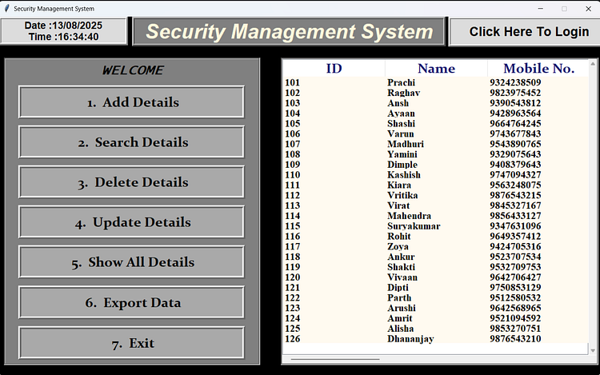

# 🛡 Security Management System

A **Digital Visitor Management System** built using **Python (Tkinter)** and **MySQL** to replace outdated paper-based visitor logs with a secure, efficient, and easy-to-use desktop application.

---

## ✨ Features
- **Digital Visitor Entry** – Instantly record visitor details without manual logs.
- **Search & Filter** – Find any visitor record in seconds.
- **Export to Excel** – Generate daily/monthly visitor reports with one click.
- **Secure Database** – MySQL backend ensures reliable and safe storage.
- **User-Friendly GUI** – Minimal and intuitive Tkinter interface.

---

## 🖼 Screenshots

| GUI View | Exported Excel Report |
|----------|----------------------|
|  |  |

---

## 🛠 Tech Stack

- **Language:** Python 3.8+
- **GUI:** Tkinter
- **Database:** MySQL
- **Libraries:**
  - `pymysql`
  - `pandas`
  - `tkinter`
  - `re`

---

## 📦 Installation & Setup

### Prerequisites
- Python 3.8+ installed → [Download Python](https://www.python.org/downloads/)
- MySQL Server installed → [Download MySQL](https://dev.mysql.com/downloads/mysql/)

### Clone the Repository
```bash
git clone https://github.com/YOUR_USERNAME/Security-Management-System.git
cd Security-Management-System
